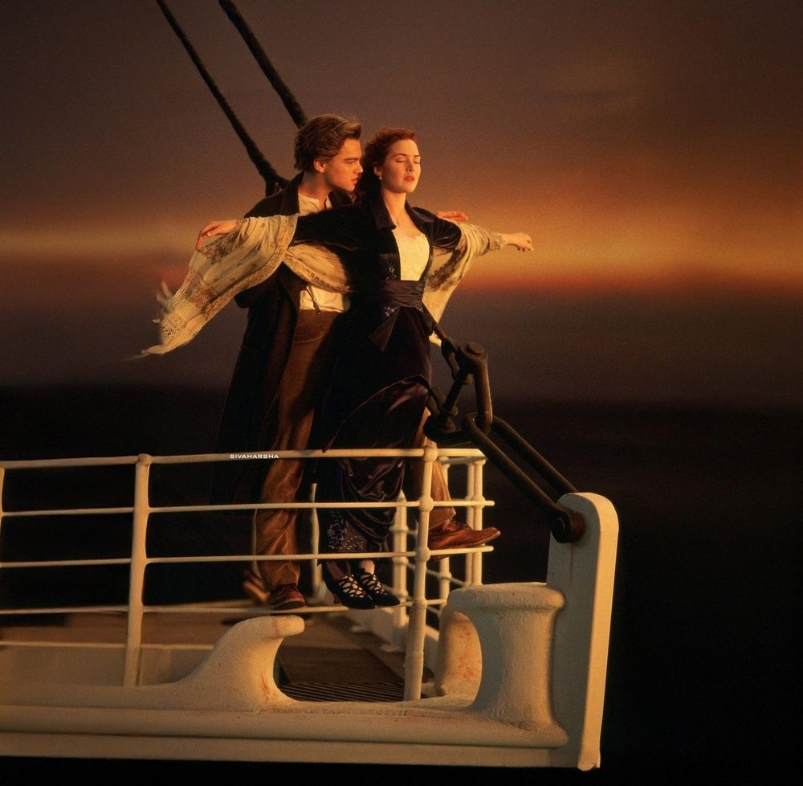

<!DOCTYPE html>
<html lang="ru">
<head>
<meta charset="UTF-8" />
<meta name="viewport" content="width=device-width, initial-scale=1.0, maximum-scale=1, user-scalable=no" />
<title>СТОП-КАДР · ОК Дагомыс</title>
<meta name="description" content="Фотоквест «Стоп-кадр» в ОК Дагомыс — восстанови культовые кинокадры в локациях отеля" />

<!-- Локально собранный CSS (Tailwind скомпилирован заранее — интернет при открытии не нужен) -->
<link rel="stylesheet" href="styles.css">

<!-- Шрифты: Bebas Neue (афишный, для заголовков) + Inter (для текста) -->
<link rel="preconnect" href="https://fonts.googleapis.com">
<link rel="preconnect" href="https://fonts.gstatic.com" crossorigin>
<link href="https://fonts.googleapis.com/css2?family=Bebas+Neue&family=Inter:wght@400;500;600;700;800&display=swap" rel="stylesheet">

</head>

<body class="bg-reel-black min-h-screen vignette">

<!-- Плёночное зерно поверх всего интерфейса -->

<!-- Боковые перфорационные рейки, имитирующие киноплёнку -->

  

  

  <!-- ============================================================ -->
  <!-- ШАПКА (общая для всех экранов, кроме приветственного) -->
  <!-- ============================================================ -->
  <header id="app-header" class="hidden sticky top-0 z-30 pt-5 pb-3 bg-reel-black/90 backdrop-blur-sm">
    

      

        <svg width="26" height="26" viewBox="0 0 24 24" fill="none" xmlns="http://www.w3.org/2000/svg">
          <path d="M3 9L20 5.5L21 9.5L4 13L3 9Z" fill="#D4AF37"/>
          <path d="M3 9L7 6L11 8.5L7.5 11L3 9Z" fill="#08080B" fill-opacity="0.35"/>
          <path d="M11 8.5L14 5.5L18 8L15 11L11 8.5Z" fill="#08080B" fill-opacity="0.35"/>
          <rect x="3" y="12.5" width="18" height="8" rx="1.2" fill="#D4AF37"/>
        </svg>
        

          
ОК Дагомыс

          
СТОП-КАДР

        

      

      

        

          0 / 10
        

        <a href="admin.html" aria-label="Панель организатора" class="w-8 h-8 rounded-full border border-reel-gold/25 flex items-center justify-center text-reel-muted hover:text-reel-gold flex-shrink-0">
          <svg width="15" height="15" viewBox="0 0 24 24" fill="none"><path d="M12 15.5a3.5 3.5 0 100-7 3.5 3.5 0 000 7z" stroke="currentColor" stroke-width="1.8"/><path d="M19.4 13.5a1.65 1.65 0 00.33 1.82l.06.06a2 2 0 11-2.83 2.83l-.06-.06a1.65 1.65 0 00-1.82-.33 1.65 1.65 0 00-1 1.51V19.5a2 2 0 11-4 0v-.09a1.65 1.65 0 00-1.08-1.51 1.65 1.65 0 00-1.82.33l-.06.06a2 2 0 11-2.83-2.83l.06-.06a1.65 1.65 0 00.33-1.82 1.65 1.65 0 00-1.51-1H4.5a2 2 0 110-4h.09a1.65 1.65 0 001.51-1.08 1.65 1.65 0 00-.33-1.82l-.06-.06a2 2 0 112.83-2.83l.06.06a1.65 1.65 0 001.82.33H10a1.65 1.65 0 001-1.51V4.5a2 2 0 114 0v.09a1.65 1.65 0 001 1.51 1.65 1.65 0 001.82-.33l.06-.06a2 2 0 112.83 2.83l-.06.06a1.65 1.65 0 00-.33 1.82V10a1.65 1.65 0 001.51 1h.09a2 2 0 110 4h-.09a1.65 1.65 0 00-1.51 1z" stroke="currentColor" stroke-width="1.8"/></svg>
        </a>
      

    

  </header>

  <!-- ============================================================ -->
  <!-- ЭКРАН 1 — ПРИВЕТСТВИЕ -->
  <!-- ============================================================ -->
  <section id="screen-welcome" class="screen active min-h-screen flex flex-col justify-center py-10">

    

      <svg width="100%" height="150" viewBox="0 0 320 150" fill="none" xmlns="http://www.w3.org/2000/svg">
        <!-- Нижняя часть хлопушки -->
        <rect x="20" y="55" width="280" height="80" rx="6" fill="#151320" stroke="#D4AF37" stroke-opacity="0.35"/>
        <!-- Диагональные полосы -->
        <g clip-path="url(#clipBody)">
          <rect x="20" y="55" width="280" height="80" fill="#151320"/>
          <g stroke="#D4AF37" stroke-width="10">
            <line x1="10" y1="145" x2="70" y2="55"/>
            <line x1="70" y1="145" x2="130" y2="55"/>
            <line x1="130" y1="145" x2="190" y2="55"/>
            <line x1="190" y1="145" x2="250" y2="55"/>
            <line x1="250" y1="145" x2="310" y2="55"/>
          </g>
        </g>
        <defs>
          <clipPath id="clipBody">
            <rect x="20" y="55" width="280" height="80" rx="6"/>
          </clipPath>
        </defs>
        <!-- Верхняя планка (хлопается) -->
        <g>
          <rect x="14" y="18" width="286" height="26" rx="4" fill="#0D0C12" stroke="#D4AF37" stroke-opacity="0.5"/>
          <g stroke="#D4AF37" stroke-width="8" clip-path="url(#clipTop)">
            <line x1="0" y1="44" x2="24" y2="18"/>
            <line x1="30" y1="44" x2="54" y2="18"/>
            <line x1="60" y1="44" x2="84" y2="18"/>
            <line x1="90" y1="44" x2="114" y2="18"/>
            <line x1="120" y1="44" x2="144" y2="18"/>
            <line x1="150" y1="44" x2="174" y2="18"/>
            <line x1="180" y1="44" x2="204" y2="18"/>
            <line x1="210" y1="44" x2="234" y2="18"/>
            <line x1="240" y1="44" x2="264" y2="18"/>
            <line x1="270" y1="44" x2="294" y2="18"/>
          </g>
          <defs>
            <clipPath id="clipTop">
              <rect x="14" y="18" width="286" height="26" rx="4"/>
            </clipPath>
          </defs>
        </g>
      </svg>
    

    
ОК Дагомыс представляет

    <h1 class="scene-num text-center text-[64px] leading-[0.9] gold-text mb-1">СТОП-КАДР</h1>
    
фотоквест

    

      Восстанови культовые сцены из легендарных фильмов прямо в локациях отеля.
      10 кадров — 10 ролей. Камера, мотор, снято!
    

    <button id="btn-start" class="btn-primary w-full py-4 rounded-2xl font-bold text-[17px] tracking-wide uppercase">
      🎬 Начать съёмку!
    </button>

    

      Нажимая «Начать», вы соглашаетесь на публикацию кадра в фотоотчёте отеля
    

    <a href="admin.html" class="btn-ghost w-full py-3.5 rounded-2xl font-semibold text-[14px] mt-4 flex items-center justify-center gap-2">
      <svg width="16" height="16" viewBox="0 0 24 24" fill="none"><path d="M12 15.5a3.5 3.5 0 100-7 3.5 3.5 0 000 7z" stroke="currentColor" stroke-width="1.8"/><path d="M19.4 13.5a1.65 1.65 0 00.33 1.82l.06.06a2 2 0 11-2.83 2.83l-.06-.06a1.65 1.65 0 00-1.82-.33 1.65 1.65 0 00-1 1.51V19.5a2 2 0 11-4 0v-.09a1.65 1.65 0 00-1.08-1.51 1.65 1.65 0 00-1.82.33l-.06.06a2 2 0 11-2.83-2.83l.06-.06a1.65 1.65 0 00.33-1.82 1.65 1.65 0 00-1.51-1H4.5a2 2 0 110-4h.09a1.65 1.65 0 001.51-1.08 1.65 1.65 0 00-.33-1.82l-.06-.06a2 2 0 112.83-2.83l.06.06a1.65 1.65 0 001.82.33H10a1.65 1.65 0 001-1.51V4.5a2 2 0 114 0v.09a1.65 1.65 0 001 1.51 1.65 1.65 0 001.82-.33l.06-.06a2 2 0 112.83 2.83l-.06.06a1.65 1.65 0 00-.33 1.82V10a1.65 1.65 0 001.51 1h.09a2 2 0 110 4h-.09a1.65 1.65 0 00-1.51 1z" stroke="currentColor" stroke-width="1.8"/></svg>
      Я организатор — редактировать сцены
    </a>
  </section>

  <!-- ============================================================ -->
  <!-- ЭКРАН 1.5 — НАЗВАНИЕ КИНОКОМАНДЫ -->
  <!-- ============================================================ -->
  <section id="screen-team" class="screen min-h-screen flex flex-col justify-center py-10">
    
Перед стартом

    <h1 class="scene-num text-center text-4xl gold-text mb-6">Название команды</h1>
    

      Придумайте название своей кинокоманды — оно будет указано под каждым присланным кадром.
    

    <input
      id="team-name-input"
      type="text"
      maxlength="60"
      placeholder="Например: Оскароносцы"
      class="w-full bg-reel-panel2 border border-reel-gold/25 rounded-2xl px-4 py-4 text-reel-cream text-center text-lg placeholder:text-reel-muted focus:outline-none focus:border-reel-gold mb-5"
    />
    <button id="btn-team-continue" class="btn-primary w-full py-4 rounded-2xl font-bold text-[17px] tracking-wide uppercase">
      Продолжить
    </button>
    
Введите название команды

  </section>

  <!-- ============================================================ -->
  <!-- ЭКРАН 2 — СПИСОК ЗАДАНИЙ -->
  <!-- ============================================================ -->
  <section id="screen-tasks" class="screen pb-10">

    

      

        

      

      
Сыграно сцен: 0 из 10

    

    

      <!-- Карточки заданий генерируются в script.js -->
    

  </section>

  <!-- ============================================================ -->
  <!-- ЭКРАН 3 — ЗАГРУЗКА ФОТО ДЛЯ ВЫБРАННОГО ЗАДАНИЯ -->
  <!-- ============================================================ -->
  <section id="screen-upload" class="screen pb-10">
    <button id="btn-back-to-list" class="flex items-center gap-1.5 text-reel-muted text-sm mb-4">
      <svg width="16" height="16" viewBox="0 0 24 24" fill="none"><path d="M15 18l-6-6 6-6" stroke="currentColor" stroke-width="2.2" stroke-linecap="round" stroke-linejoin="round"/></svg>
      К списку сцен
    </button>

    

      
Сцена 01

      <h2 id="upload-title" class="scene-num text-3xl gold-text mb-2">Титаник</h2>
      

    

    

      <!-- Образец кадра: подставьте сюда свою картинку через placeholder.jpg или используйте data-image в script.js -->
      
      Образец
    

    <!-- Область предпросмотра выбранного фото пользователя -->
    

      
    

    <label for="photo-input" id="btn-take-photo" class="btn-ghost w-full py-4 rounded-2xl font-semibold text-[15px] flex items-center justify-center gap-2 cursor-pointer">
      <svg width="20" height="20" viewBox="0 0 24 24" fill="none"><path d="M4 8a2 2 0 012-2h1l1.2-1.6A1 1 0 019 4h6a1 1 0 01.8.4L17 6h1a2 2 0 012 2v9a2 2 0 01-2 2H6a2 2 0 01-2-2V8z" stroke="currentColor" stroke-width="1.8"/><circle cx="12" cy="13" r="3.3" stroke="currentColor" stroke-width="1.8"/></svg>
      Сфотографировать или прикрепить файл
    </label>
    <!-- Без атрибута capture: телефон предложит выбор — снять камерой или выбрать файл из галереи -->
    <input type="file" id="photo-input" accept="image/*" />

    <button id="btn-send" class="btn-primary w-full py-4 rounded-2xl font-bold text-[17px] tracking-wide uppercase mt-3 hidden">
      Отправить на монтаж
    </button>

    
Можно сделать новое фото или прикрепить готовое

  </section>
  <!-- (конец экрана загрузки фото) -->

  <!-- ============================================================ -->
  <!-- ЭКРАН 4 — ФИНАЛ (все 10 сцен сыграны) -->
  <!-- ============================================================ -->
  <section id="screen-finale" class="screen min-h-screen flex flex-col justify-center py-10 text-center">
    
ЭТО БЫЛ...

    <h1 class="scene-num text-[56px] leading-[0.9] gold-text mb-6">ВЫШЕ! ПРОРАБ!</h1>
    

      Вы сыграли все 10 культовых сцен. Съёмочная группа ОК Дагомыс аплодирует стоя.
      Загляните на ресепшен — вас ждёт сюрприз от режиссёра!
    

    <button id="btn-finale-restart" class="btn-ghost w-full py-4 rounded-2xl font-semibold text-[15px]">
      Пересмотреть список сцен
    </button>
  </section>

<!-- ============================================================ -->
<!-- МОДАЛЬНОЕ ОКНО — статус отправки на монтаж -->
<!-- ============================================================ -->

  

    

      <svg class="loader-clapper mx-auto mb-4" width="56" height="56" viewBox="0 0 24 24" fill="none">
        <rect x="3" y="10" width="18" height="9" rx="1.2" fill="#D4AF37"/>
        <rect x="2.5" y="5" width="19" height="4.5" rx="1" fill="#F0CE6B"/>
      </svg>
      
Мотор... Съёмка...

      
Отправляем кадр в монтажную

    

    

      

        🎬
      

      
Кадр принят!

      
Режиссёр уже оценивает 🎬

      <button id="btn-status-continue" class="btn-primary w-full py-3.5 rounded-xl font-bold text-sm uppercase mt-6">Дальше</button>
    

    

      

        🎞️
      

      
Дубль не удался

      
Проверьте связь и попробуйте снова

      <button id="btn-status-retry" class="btn-primary w-full py-3.5 rounded-xl font-bold text-sm uppercase mt-6">Повторить</button>
    

  

</body>
</html>
